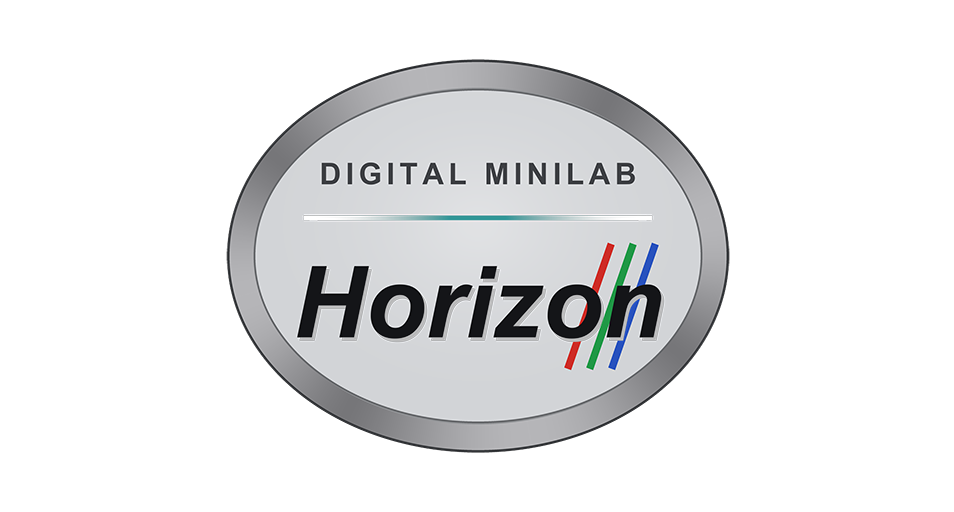
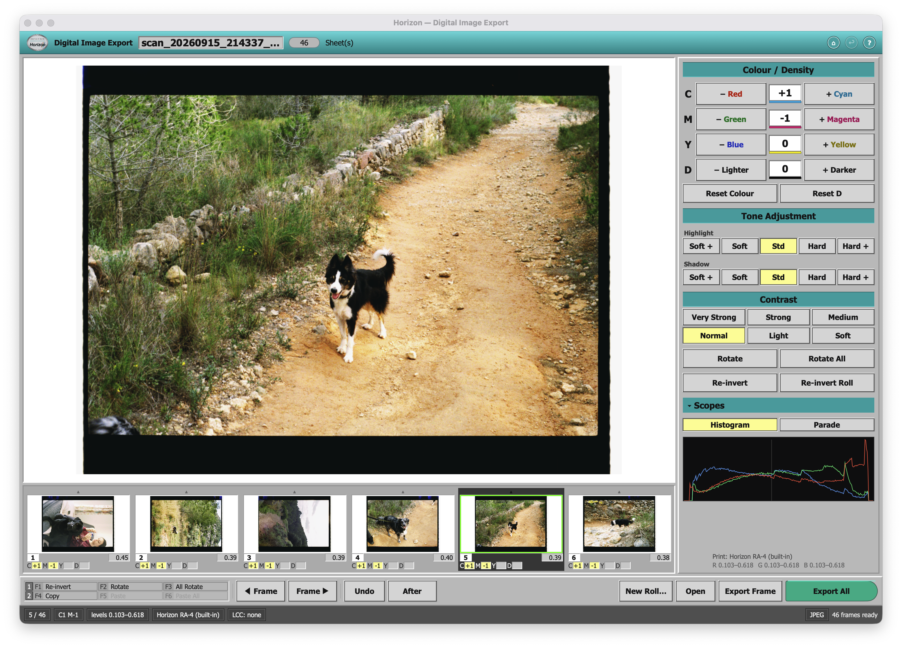
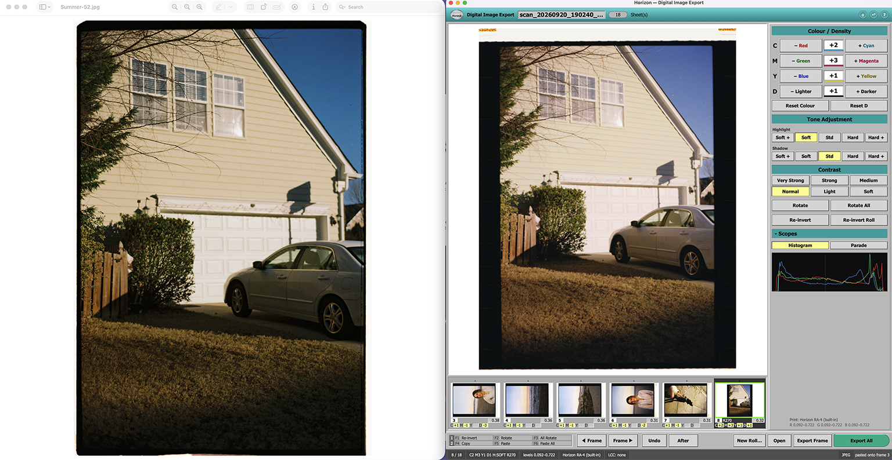
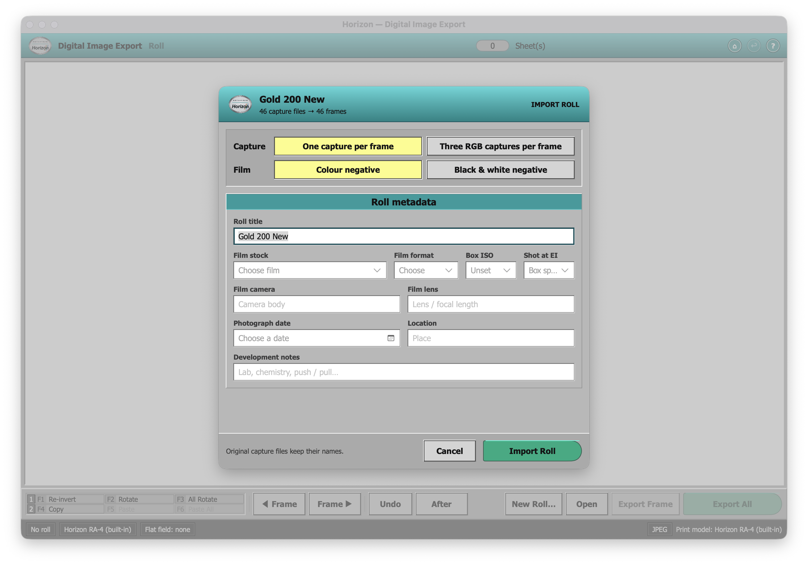
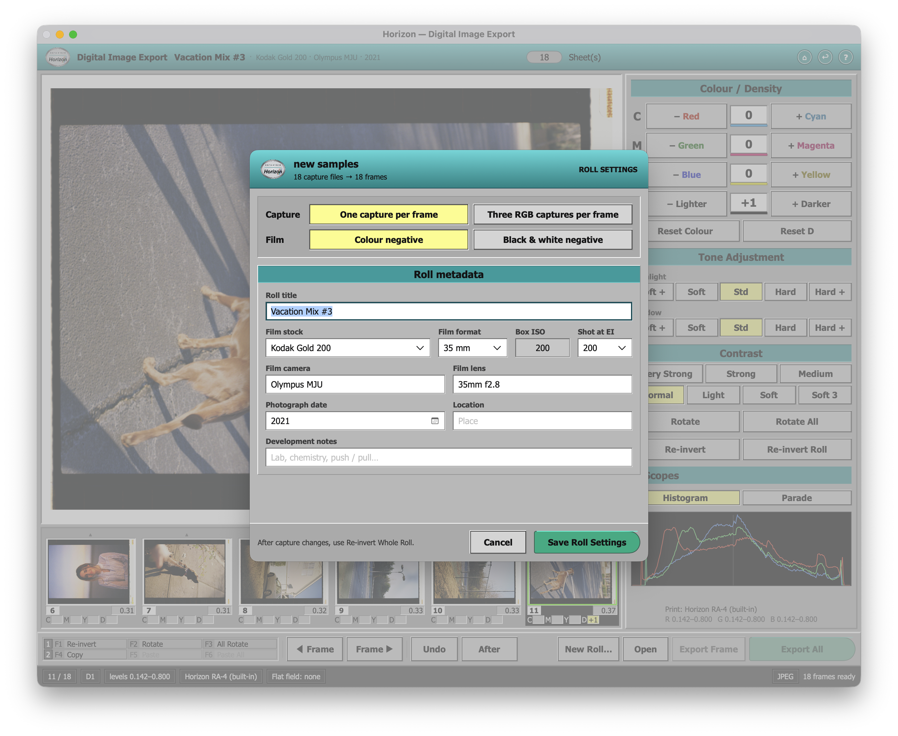
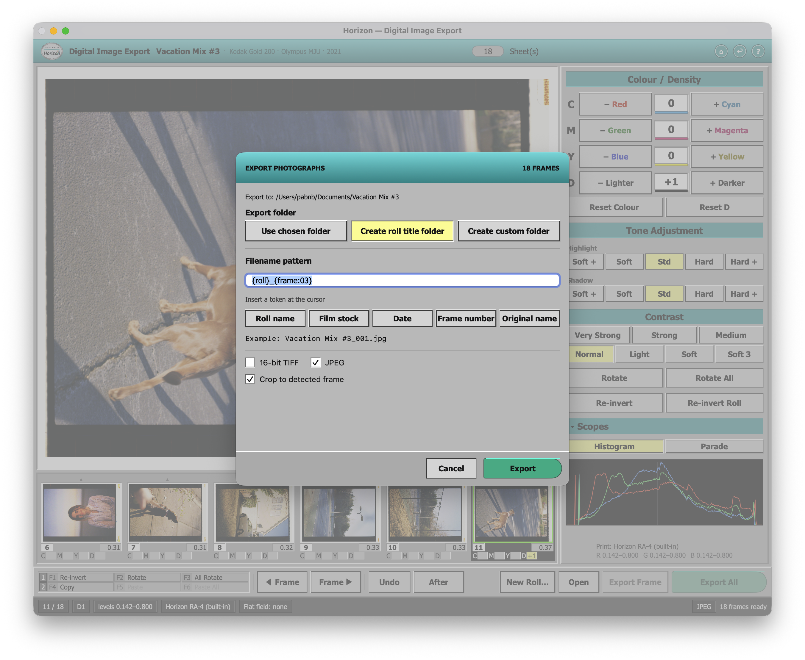

Horizon is a macOS app for turning camera scans of colour and black-and-white film negatives into positive photographs. Import a roll, balance its frames, and export with your own filenames and photographic metadata.



## Requirements and formats

Horizon runs on **macOS 14 or later**. Building from source requires an installed Swift toolchain from Xcode or Command Line Tools. There are no third-party Swift package dependencies.

| Area | Supported workflow |
| --- | --- |
| Capture files | 8-bit or 16-bit TIFF and PNG; camera RAW supported by Apple's installed decoder |
| Capture arrangement | One capture per frame, or three RGB captures per frame |
| Film | Colour negative or black-and-white negative |
| App exports | 16-bit TIFF, JPEG, or both, rendered to sRGB |

RAW is demosaiced in memory through Apple's Core Image decoder and enters the same inversion path as TIFF. Optional decoder enhancements are disabled, including exposure compensation, tone mapping, sharpening, noise reduction, and lens correction. Apple's required demosaicing, camera-to-RGB conversion, and camera white point remain part of decoding. No intermediate debayered TIFF is written; only the normal inverted master cache is saved. Camera and file support depend on macOS. For bitmap captures, 16-bit files retain more density precision than 8-bit files.

## Start a roll

1. Drop a capture folder onto Horizon, or choose **File → New Roll…**.
2. Check the capture arrangement, film type, and displayed frame count. Add any known roll metadata, then choose **Import Roll**.
3. Choose a print model under **Settings → Print Emulation**, adjust the photographs, and compare frames in **View → Review Grid**.
4. Choose **File → Export Selected Frame** or **Export All Frames**, select a destination, and set your naming pattern.

Reopen a saved roll from **Recent Orders** or **File → Open Recent**. Complete, current caches are reused. See the [workflow guide](WORKFLOW_GUIDE.md) for the controls and optional border checks.

## Roll metadata

Record the roll name, film stock and format, box ISO, shooting EI, film camera and lens, photograph date, location, and development notes. Film stock, format, and EI have pickers. Catalog stocks supply their box ISO; EI follows box speed unless you choose another rating. Custom stocks allow a manual ISO.

The date picker accepts an exact day, **Month & year**, or **Year only**. It can also remain empty. Partial dates keep their precision in metadata, filenames, and captions; Horizon does not invent a day for them.

The editing header and Recent Orders show a compact **film stock · camera · year** summary, omitting empty fields. In Recent Orders, it sits beside the folder name in lighter text. Use the row's pencil button to edit metadata without loading the photographs, or open **File → Roll Settings…** for the current roll. Metadata changes do not require re-inversion. Capture-arrangement changes do.

## Image processing and print emulation

```text
TIFF / PNG / in-memory RAW decode
  → negative inversion and film-base subtraction
  → cached 16-bit Cineon master
  → frame levels, exposure, colour balance, and tone adjustments
  → built-in RA-4 model, one .cube LUT, or one ICC print profile
  → sRGB output
```

**Exposure and colour adjustments happen before print emulation.** Editing re-renders the cached master without rewriting it. A LUT, ICC profile, or built-in RA-4 model occupies the final print stage; the models are not stacked.

The **Shouldered Contrast Curve** is the default and lives under **Settings → Curve**. An explicitly saved legacy-curve preference is still respected.

| Control under Settings → Curve | When it applies |
| --- | --- |
| Print Contrast: Calmer / Normal / Punchier | **Horizon RA-4 (built-in)** is the active print model |
| Highlight Rolloff: Softer / Normal / Harder | A `.cube` or ICC model is active and Shouldered Contrast Curve is enabled |

If Print Contrast is unavailable, select **Settings → Print Emulation → Horizon RA-4 (built-in)**. Availability follows the transform that actually loaded, including fallback after a missing or rejected external file. Keep external LUTs and ICC profiles organized yourself; Horizon stores their paths rather than copying them into every roll.

**Edit → Correct Roll Colour** (⌘K) estimates and applies a shared colour-cast correction in one action. It evaluates the active print model while applying the correction before that model. The operation is reversible with Undo and leaves the roll unchanged when there is insufficient consistent neutral evidence.

An optional flat-field capture for uneven scan illumination can be selected through **Settings → Advanced → Choose Flat-Field Reference…**. Re-invert to apply a changed reference.


## Automatic carrier handling — Beta

**Settings → Automatic Carrier Handling — Beta** is a working per-roll toggle. New imports start with it **on**; reopening a saved roll restores its saved or pending choice. Its supplemental mask is used only where the ordinary border detector found no border and repeated carrier evidence passes the checks.

Changing the toggle stages a request. Choose **Settings → Re-invert Whole Roll** to apply it. Until that rebuild succeeds, the existing measurements remain in use, and export, selected-frame re-inversion, and roll colour correction are unavailable. Toggling back cancels the request if the cache is complete; an incomplete cache still needs a whole-roll rebuild. Changing the setting requires the original captures and a readable saved session.

Debug images are generated **only on demand**:

- **Settings → Generate Border Debug Images…** runs an inspection and opens a preview.
- **Settings → Show Border Debug Images** opens the saved reports in `Horizon/debug/borders`.

The PNGs show averages for matching scan sizes and ordinary, proposed, and saved border geometry. Diagnostics do not change the masters or applied masks. The average image is a visual aid; the detector uses repeated opaque-edge evidence across at least three matching-size frames. The supplemental mask excludes areas from rendering measurements; it does not change the export crop or film-base estimate, and it does not extend a border already found by the ordinary detector. See [the carrier review](BORDER_REVIEW.md) for measured limits.

## Export and naming

The export sheet offers **16-bit TIFF**, **JPEG**, or both; optional cropping to the detected frame; and a choice of the selected destination, a roll-title folder, or a custom folder.

Build a filename pattern by typing text and clicking the token buttons. A button inserts at the cursor or replaces selected text, and a live example shows the result. Enter the name without a file extension; Horizon adds the selected format's extension.

| Token | Value |
| --- | --- |
| `{roll}` | Roll title |
| `{stock}` | Film stock |
| `{date}` | Photograph date at its saved precision |
| `{frame:03}` | One-based roll frame number, padded to three digits |
| `{original}` | Original frame name without its extension |

For a roll named `Valencia`, dated September 2026, `{date}_{roll}_{frame:03}` produces names such as `2026-09_Valencia_012.tif`. Exporting frame 12 on its own still uses `012`.

Horizon validates all output names before creating an optional folder. Duplicate names and existing files stop the export instead of being overwritten. Photographic details are embedded where the output format supports them; scan-camera EXIF is not substituted for the film camera's details. Missing metadata contributes an empty token value, so check the example before exporting.

## Where your work lives

Source captures keep their names. Horizon writes a workspace beside them:

| Path inside the capture folder | Contents |
| --- | --- |
| `Horizon/metadata.json` | Photographic roll metadata |
| `Horizon/edits.json` | Frame adjustments |
| `Horizon/session.json` | Saved capture recipe, border measurements, and carrier choice |
| `Horizon/cache/` | Rebuildable inverted masters and cache manifest |
| `Horizon/debug/borders/` | Requested diagnostic reports |

Keep the workspace with the original captures when moving or backing up a roll. Existing rolls using a `Frontier/` workspace continue to use it. Cache checks detect incomplete masters and changed sources or inversion settings; failed saves are reported, and unreadable edit or metadata files are preserved.

## Build and checks

From the repository folder:

```sh
./make-app.sh
open Horizon.app
```

The build uses the installed toolchain and produces `Horizon.app` beside the source. `SDKROOT` can select an installed macOS SDK when needed. The script cleans its temporary build and compiler caches and may regenerate the app icon from the included source image.

To run the regression suite and numerical rendering checks:

```sh
./Tests/run-invert-edge-tests.sh
./Horizon.app/Contents/MacOS/Horizon --check-grade
```

The regression runner removes its temporary fixtures, executable, and module cache on exit. Tests cover inversion and recovery, carrier diagnostics, render consistency, colour correction, export dialogs and naming, and recent-roll metadata.

## Current limits

- RAW decoding needs validation with representative camera files; extension recognition alone does not guarantee Apple's decoder supports a particular camera.
- Carrier handling remains Beta. Its automated coverage is synthetic; moving or inconsistent carrier geometry can leave the ordinary detector unchanged. Real-roll quality still needs review.
- Automated checks pass, but a complete manual pass through the latest menus and sheets remains outstanding.
- Open-roll previews remain in memory, so unusually large rolls can use substantial RAM.




## Horizon quick workflow guide

### 1. Import a roll

Keep one roll's captures in a folder. Drop it onto Horizon or choose **File → New Roll…** (⌘N). TIFF, PNG, and camera RAW supported by Apple's decoder use the same workflow; RAW needs no intermediate conversion file.

In the import sheet:

- Choose **One capture per frame** or **Three RGB captures per frame**, then check the displayed frame count.
- Choose **Colour negative** or **Black & white negative** where available.
- Fill in **Roll metadata**. Select the film stock and format; catalog stocks fill box ISO and default EI to box speed. Change EI if you rated the film differently.
- Add a camera, lens, date, location, or development notes if known. The date picker supports a full date, month and year, or year only. Unknown fields can stay empty.



Choose **Import Roll** and let inversion finish. Automatic carrier handling starts on. Reopen finished rolls through **Recent Orders** or **File → Open Recent**.

### 2. Choose the print look and adjust a frame

Start with **Settings → Print Emulation → Horizon RA-4 (built-in)**, or load your `.cube` LUT or ICC print emulation. Only one print model is active.

The shouldered contrast curve is on by default under **Settings → Curve**. For built-in RA-4, **Print Contrast** offers Calmer, Normal, and Punchier. With a LUT or ICC profile, those choices are unavailable; **Highlight Rolloff** is available when the shouldered curve is on.

Use **Colour / Density** for colour balance and Darker/Lighter adjustments, then **Tone Adjustment** for contrast, highlights, and shadows. All these corrections happen before print emulation, leaving the cached master unchanged.

Hold **B** or the Before/After button to compare against the frame without its edits. Release to return to the edited view. Undo is **⌘Z**.

### 3. Balance the roll

Use **View → Review Grid** (⌘G) to compare 6, 8, or 12 frames. Move between frames with the left and right arrow keys.

For a consistent shared cast, try **Edit → Correct Roll Colour** (⌘K). This analyzes and applies the correction in one step; use Undo if it does not suit the photographs. It is unavailable for black-and-white film.

Use the bottom strip's **Copy**, **Paste**, and **Paste All** controls to reuse a frame's adjustments. Check the roll after applying shared edits.

### 4. Check borders when a scan looks wrong

For a large carrier area or suspicious exposure measurements, choose **Settings → Generate Border Debug Images…**. It opens a preview with average scans and border overlays. **Show Border Debug Images** opens the report folder. Generating a report does not alter your photographs or apply a new mask.

Automatic carrier handling is already on for new imports and only supplements qualifying problem areas. To compare the roll with it off:

1. Toggle **Settings → Automatic Carrier Handling — Beta**.
2. Choose **Settings → Re-invert Whole Roll** to apply the change.
3. Inspect the same frames again. Repeat the two steps to turn it back on.

The choice is saved for that roll. While a change is pending, export, colour correction, and selected-frame re-inversion wait for the whole-roll rebuild. Toggling back before rebuilding cancels the request only when the cache is complete. The Beta mask affects measurements, not export cropping.

### 5. Review metadata and export

Click the editing header or choose **File → Roll Settings…** to check the roll metadata. You can also use a Recent Orders row's pencil button without opening the photographs. Metadata edits need no re-inversion. The header and recent list show only **film stock · camera · year**, with empty fields omitted.



Choose **File → Export Selected Frame** (⌘E) or **Export All Frames** (⇧⌘E), then select a destination. In the export sheet:

1. Choose **Use chosen folder**, **Create roll title folder**, or **Create custom folder**. Keep exports in their own folder or subfolder, separate from source captures.
2. Set a filename pattern. Click the token buttons to insert at the cursor or replace selected text; type any fixed text and separators you want. Leave off the file extension.
3. Check the live example. For example, `{date}_{roll}_{frame:03}` can become `2026-09_Valencia_012.tif`. Other tokens are `{stock}` and `{original}`. Empty metadata produces empty token values.
4. Select **16-bit TIFF**, **JPEG**, or both. Enable **Crop to detected frame** if wanted, then choose **Export**.




The selected frame keeps its number within the roll. If a name already exists or several frames would receive the same name, change the pattern or destination. Photographic metadata is included where the format supports it.

### Useful shortcuts

| Action | Shortcut |
| --- | --- |
| Previous / next frame | ← / → |
| Darker / lighter | ↑ / ↓; hold Shift for larger steps |
| Compare before edits | Hold B |
| Undo / redo | ⌘Z / ⇧⌘Z |
| Correct Roll Colour | ⌘K |
| Review Grid | ⌘G |
| Rotate frame / roll | ⌘R / ⇧⌘R |
| Copy / paste / paste all | F4 / F5 / F6, or the bottom-strip buttons |
| Export frame / roll | ⌘E / ⇧⌘E |

Edits and roll metadata are saved beside the captures in the `Horizon` workspace. Keep that folder with your originals. Print LUT and ICC files remain external; keep them in a stable location too.
